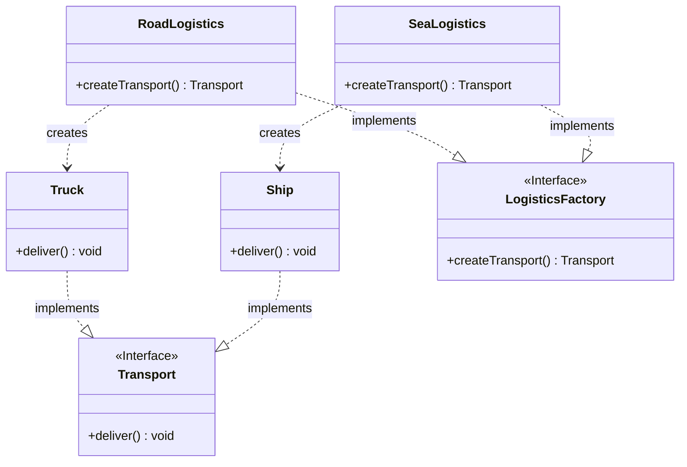

```mermaid
classDiagram
    class Transport {
        <<Interface>>
        +deliver() void
    }

    class Truck {
        +deliver() void
    }
    class Ship {
        +deliver() void
    }

    class LogisticsFactory {
        <<Interface>>
        +createTransport() Transport
    }

    class RoadLogistics {
        +createTransport() Transport
    }
    class SeaLogistics {
        +createTransport() Transport
    }

    Truck ..|> Transport : implements
    Ship ..|> Transport : implements
    
    RoadLogistics ..|> LogisticsFactory : implements
    SeaLogistics ..|> LogisticsFactory : implements
    
    RoadLogistics ..> Truck : creates
    SeaLogistics ..> Ship : creates
```